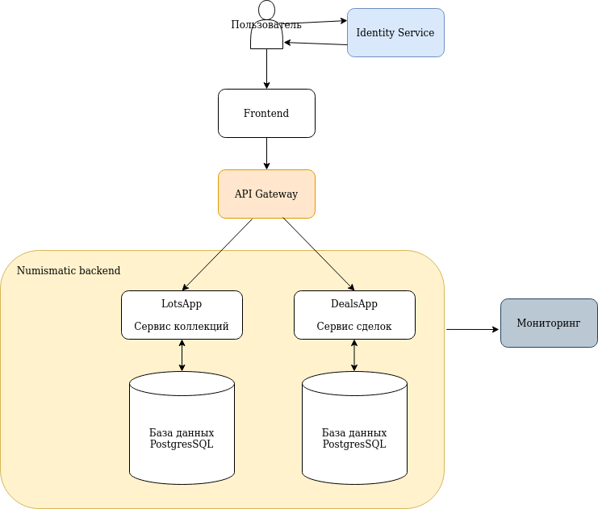

# Приложение для нумизматов #
Приложение позволяет вести учет (добавление, редактирование, удаление) монет (банкнот) своей коллекции
и осуществялть их обмен или продажу.

## Целевая аудитория ##
1. *Банк России*. В рамках своей [эмиссионной деятельности](https://cbr.ru/cash_circulation/memorable_coins/) Банк России выпускает в обращение памятные монеты из драгоценных и недрагоценных металлов и инвестиционные монеты из драгоценных металлов, которые распространяются как внутри страны, так и за границей.
2. *Нумизматы* - лица, увлеченные собиранием, коллекционированием монет и банкнот.
3. *Продавцы*:
   1. *Банки* - коммерческие [организации](https://cbr.ru/cash_circulation/memorable_coins/list_org_coins/), с которыми Банк России заключил соглашения (договоры) о распространении памятных и инвестиционных монет. 
   2. *Нумизматические фирмы и клубы* - организации, помогающие коллекционерам в поиске и приобретении интересующих их объектов коллекционирования.
   3. *Спекулянты* - лица, зарабатывающие на перепродаже монет. 

### Гипотетический портрет нумизмата ###
1. Мужчина от 30 до 80 лет (женщин практически нет).
2. В основном высшее образование.
3. Стабильный доход не ниже среднего, т.к. это не самое дешевое увлечение.

### Гипотетический портрет спекулянта ###
1. Возраст от 30 лет, пол не имеет значения.
2. Образование не имеет значения.
3. Наличие больших сумм денежных средств.
4. Возможен сговор нескольких предствителей данной группы по удеражнию цен на определенные монеты для получения максимальной прибыли.

В банках и нумизматических магазинах продажи монет и банкнот осуществяют работники данных организаций - менеджеры.

### Гипотетический портрет менеджера банка ##
1. Мужчина от 25 до 45 лет.
2. Высшее образование.
3. Продажи в основном через заказы, очень редко через личные контакты постоянным клиентам.
4. Достаточно внимательно отслеживает цены на монеты, чтобы не продать ниже рынка.

### Гипотетический портрет менеджера нумизматического магазина ##
1. Молодой мужчина или женщина от 18 до 25 лет.
2. Скорее всего учится, работа в магазине является подработкой.
3. Всё равно, что и кому продавать, лишь бы купили, как правило не разбирается в предментой области.

## MVP ##
1. Создание, изменение, удаление, поиск *лотов* - элементов коллекции (монет или банкнот).

В перспективе:
1. Создание, изменение, удаление *разделов* коллекции (с API версии 2).
2. Поиск лотов для покупки или обмена.
3. Обсуждение условий сделок по прожаже (обмену) лотов. 
4. Создание сделок по прожаже (обмену) лотов.

## Эскиз фронтенд-представления ##

## Сущности приложения ##

1. *Раздел* (версия 2 API, в версии 1 не будет). Содержит информацию:
   * Владелец;
   * Раздел-родитель;
   * Название.
2. *Лот*. Содержит информацию об элементе коллекции:
   * Владелец;
   * Раздел (API версии 2, в API версии 1 будет пустое значение);
   * Тип (монета или банкнота);
   * Название;
   * Год выпуска;
   * Страна-эмитент;
   * Каталожный номер;
   * Номинал;
   * Материал изготовления;
   * Масса в граммах;
   * Состояние;
   * Серийный номер или сертификат;
   * Описание;
   * Рыночная цена (в рублях). Корректируется коллекционером по необходимости;
   * Фотографии;
   * Количество;
   * Статус.
3. *Сделка*. Содержит информацию о покупке/обмене лота:
   * Стороны сделки:
      * Новый владелец;
      * Старый владелец;
   * Лоты покупки, обмена:
     * При обмене каждому лоту может соответствовать один или несколько лотов другой стороны плюс сумма доплаты в рублях;
     * При покупке каждому лоту соответствовует сумма покупки в рублях.
4. *Страна*. Справочник стран, выпускающих лоты.
5. *Материал*. Справочник материалов, из которых изготовлены лоты.

## Архитектурное видение приложения ##

